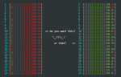
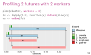
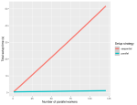
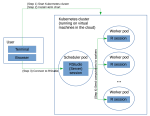
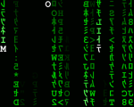
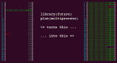
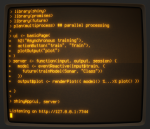

 

  
 

 

  

   
<a href="https://www.jottr.org/2023/07/01/parallelly-managing-workers/">parallelly: Querying, Killing and Cloning Parallel Workers Running Locally or Remotely</a>
   

  

  

   
Henrik Bengtsson

   
   
2023-07-01

  

 

 

  
 

 

  

   
<a href="https://www.jottr.org/2023/06/26/dofuture/">%dofuture% - a Better foreach() Parallelization Operator than %dopar%</a>
   

  

  

   
Henrik Bengtsson

   
   
2023-06-26

  

 

 

  
 

 

  

   
<a href="https://www.jottr.org/2023/01/18/parallelly-1.34.0-support-for-cgroups-v2-killing-parallel-workers-and-more/">parallelly 1.34.0: Support for CGroups v2, Killing Parallel Workers, and more</a>
   

  

  

   
Henrik Bengtsson

   
   
2023-01-18

  

 

 

  
 

 

  

   
<a href="https://www.jottr.org/2023/01/10/progressr-0.13.0/">progressr 0.13.0: cli + progressr = ♥</a>
   

  

  

   
Henrik Bengtsson

   
   
2023-01-10

  

 

 

  
 

 

  

   
<a href="https://www.jottr.org/2022/12/05/avoid-detectcores/">Please Avoid detectCores() in your R Packages</a>
   

  

  

   
Henrik Bengtsson

   
   
2022-12-05

  

 

 

  
 

 

  

   
<a href="https://www.jottr.org/2022/06/23/future-user2022-slides/">useR! 2022: My 'Futureverse: Profile Parallel Code' Slides</a>
   

  

  

   
Henrik Bengtsson

   
   
2022-06-24

  

 

 

  
 

 

  

   
<a href="https://www.jottr.org/2022/06/09/parallelly-support-for-fujitsu-technical-computing-suite-high-performance-compute-hpc-environments/">parallelly: Support for Fujitsu Technical Computing Suite High-Performance Compute (HPC) Environments</a>
   

  

  

   
Henrik Bengtsson

   
   
2022-06-09

  

 

 

  
 

 

  

   
<a href="https://www.jottr.org/2022/06/08/parallelly-1.32.0-makeclusterpsock-didnt-work-with-chinese-and-korean-locales/">parallelly 1.32.0: makeClusterPSOCK() Didn't Work with Chinese and Korean Locales</a>
   

  

  

   
Henrik Bengtsson

   
   
2022-06-08

  

 

 

  
 

 

  

   
<a href="https://www.jottr.org/2022/06/03/progressr-0.10.1/">progressr 0.10.1: Plyr Now Supports Progress Updates also in Parallel</a>
   

  

  

   
Henrik Bengtsson

   
   
2022-06-03

  

 

 

  
 

 

  

   
<a href="https://www.jottr.org/2022/04/22/parallelly-1.31.1/">parallelly 1.31.1: Better at Inferring Number of CPU Cores with Cgroups and Linux Containers</a>
   

  

  

   
Henrik Bengtsson

   
   
2022-04-22

  

 

 

  
 

 

  

   
<a href="https://www.jottr.org/2022/02/22/future-1.24.0-forwarding-rng-state-also-for-stand-alone-futures/">future 1.24.0: Forwarding RNG State also for Stand-Alone Futures</a>
   

  

  

   
Henrik Bengtsson

   
   
2022-02-22

  

 

 

  
 

 

  

   
<a href="https://www.jottr.org/2022/01/07/future-during-2021/">Future Improvements During 2021</a>
   

  

  

   
Henrik Bengtsson

   
   
2022-01-07

  

 

 

  
 

 

  

   
<a href="https://www.jottr.org/2021/11/22/parallelly-1.29.0/">parallelly 1.29.0: New Skills and Less Communication Latency on Linux</a>
   

  

  

   
Henrik Bengtsson

   
   
2021-11-22

  

 

 

  
 

 

  

   
<a href="https://www.jottr.org/2021/06/11/progressr-0.8.0/">progressr 0.8.0: RStudio's Progress Bar, Shiny Progress Updates, and Absolute Progress</a>
   

  

  

   
Henrik Bengtsson

   
   
2021-06-11

  

 

 

  
 

 

  

   
<a href="https://www.jottr.org/2021/06/10/parallelly-1.26.0/">parallelly 1.26.0: Fast, Concurrent Setup of Parallel Workers (Finally)</a>
   

  

  

   
Henrik Bengtsson

   
   
2021-06-10

  

 

 

  
 

 

  

   
<a href="https://www.jottr.org/2021/04/30/parallelly-1.25.0/">parallelly 1.25.0: availableCores(omit=n) and, Finally, Built-in SSH Support for MS Windows 10 Users</a>
   

  

  

   
Henrik Bengtsson

   
   
2021-04-30

  

 

 

  
 

 

  

   
<a href="https://www.jottr.org/2021/04/08/future-and-kubernetes/">Using Kubernetes and the Future Package to Easily Parallelize R in the Cloud</a>
   

  

  

   
Chris Paciorek

   
A guest post by Chris Paciorek, Department of Statistics, University of California at Berkeley.

   
2021-04-08

  

 

 

  
 

 

  

   
<a href="https://www.jottr.org/2021/01/08/future.batchjobs-end-of-life-announcement/">future.BatchJobs - End-of-Life Announcement</a>
   

  

  

   
Henrik Bengtsson

   
   
2021-01-08

  

 

 

  
 

 

  

   
<a href="https://www.jottr.org/2020/11/06/future-1.20.1-the-future-just-got-a-bit-brighter/">future 1.20.1 - The Future Just Got a Bit Brighter</a>
   

  

  

   
Henrik Bengtsson

   
   
2020-11-06

  

 

 

  
 

 

  

   
<a href="https://www.jottr.org/2020/11/04/parallelly-future-cleaning-up-around-the-house/">parallelly, future - Cleaning Up Around the House</a>
   

  

  

   
Henrik Bengtsson

   
   
2020-11-04

  

 

 

  
 

 

  

   
<a href="https://www.jottr.org/2020/11/04/trust-the-future/">Trust the Future</a>
   

  

  

   
Henrik Bengtsson

   
   
2020-11-04

  

 

 

  
 

 

  

   
<a href="https://www.jottr.org/2020/09/22/push-for-statical-sound-rng/">future 1.19.1 - Making Sure Proper Random Numbers are Produced in Parallel Processing</a>
   

  

  

   
Henrik Bengtsson

   
   
2020-09-22

  

 

 

  
 

 

  

   
<a href="https://www.jottr.org/2020/09/21/detect-when-the-random-number-generator-was-used/">Detect When the Random Number Generator Was Used</a>
   

  

  

   
Henrik Bengtsson

   
   
2020-09-21

  

 

 

  
 

 

  

   
<a href="https://www.jottr.org/2020/07/11/future-future.apply-recent-improvements/">future and future.apply - Some Recent Improvements</a>
   

  

  

   
Henrik Bengtsson

   
   
2020-07-11

  

 

 

  
 

 

  

   
<a href="https://www.jottr.org/2019/11/09/resolved-launches-lazy-futures/">future 1.15.0 - Lazy Futures are Now Launched if Queried</a>
   

  

  

   
Henrik Bengtsson

   
   
2019-11-09

  

 

 

  
 

 

  

   
<a href="https://www.jottr.org/2019/01/11/parallelize-a-for-loop-by-rewriting-it-as-an-lapply-call/">Parallelize a For-Loop by Rewriting it as an Lapply Call</a>
   

  

  

   
Henrik Bengtsson

   
   
2019-01-11

  

 

 

  
 

 

  

   
<a href="https://www.jottr.org/2019/01/07/maintenance-updates-of-future-backends-and-dofuture/">Maintenance Updates of Future Backends and doFuture</a>
   

  

  

   
Henrik Bengtsson

   
   
2019-01-07

  

 

 

  
 

 

  

   
<a href="https://www.jottr.org/2018/07/23/output-from-the-future/">future 1.9.0 - Output from The Future</a>
   

  

  

   
Henrik Bengtsson

   
   
2018-07-23

  

 

 

  
 

 

  

   
<a href="https://www.jottr.org/2018/06/23/future.apply_1.0.0/">future.apply - Parallelize Any Base R Apply Function</a>
   

  

  

   
Henrik Bengtsson

   
   
2018-06-23

  

 

 

  
 

 

  

   
<a href="https://www.jottr.org/2018/04/12/future-results/">future 1.8.0: Preparing for a Shiny Future</a>
   

  

  

   
Henrik Bengtsson

   
   
2018-04-12

  

 

 

  
 

 

  

   
<a href="https://www.jottr.org/2017/06/05/many-faced-future/">The Many-Faced Future</a>
   

  

  

   
Henrik Bengtsson

   
   
2017-06-05

  

 

 

  
 

 

  

   
<a href="https://www.jottr.org/2017/03/18/dofuture/">doFuture: A Universal Foreach Adaptor Ready to be Used by 1,000+ Packages</a>
   

  

  

   
Henrik Bengtsson

   
   
2017-03-18

  

 

 

  
 

 

  

   
<a href="https://www.jottr.org/2017/02/19/future-rng/">future 1.3.0: Reproducible RNGs, future_lapply() and More</a>
   

  

  

   
Henrik Bengtsson

   
   
2017-02-19

  

 

 

  
 

 

  

   
<a href="https://www.jottr.org/2016/10/22/future-hpc/">High-Performance Compute in R Using Futures </a>
   

  

  

   
Henrik Bengtsson

   
   
2016-10-22

  

 

 

  
 

 

  

   
<a href="https://www.jottr.org/2016/10/11/future-remotes/">Remote Processing Using Futures</a>
   

  

  

   
Henrik Bengtsson

   
   
2016-10-11

  

 

