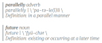

 

  
 

 

  

   
<a href="https://www.jottr.org/2021/04/08/future-and-kubernetes/">Using Kubernetes and the Future Package to Easily Parallelize R in the Cloud</a>
   

  

  

   
Chris Paciorek

   
A guest post by Chris Paciorek, Department of Statistics, University of California at Berkeley.

   
2021-04-08

  

 

 

  
 

 

  

   
<a href="https://www.jottr.org/2021/01/08/future.batchjobs-end-of-life-announcement/">future.BatchJobs - End-of-Life Announcement</a>
   

  

  

   
Henrik Bengtsson

   
   
2021-01-08

  

 

 

  
 

 

  

   
<a href="https://www.jottr.org/2020/11/06/future-1.20.1-the-future-just-got-a-bit-brighter/">future 1.20.1 - The Future Just Got a Bit Brighter</a>
   

  

  

   
Henrik Bengtsson

   
   
2020-11-06

  

 

 

  
 

 

  

   
<a href="https://www.jottr.org/2020/11/04/parallelly-future-cleaning-up-around-the-house/">parallelly, future - Cleaning Up Around the House</a>
   

  

  

   
Henrik Bengtsson

   
   
2020-11-04

  

 

 

  
 

 

  

   
<a href="https://www.jottr.org/2020/11/04/trust-the-future/">Trust the Future</a>
   

  

  

   
Henrik Bengtsson

   
   
2020-11-04

  

 

 

  
 

 

  

   
<a href="https://www.jottr.org/2020/09/22/push-for-statical-sound-rng/">future 1.19.1 - Making Sure Proper Random Numbers are Produced in Parallel Processing</a>
   

  

  

   
Henrik Bengtsson

   
   
2020-09-22

  

 

 

  
 

 

  

   
<a href="https://www.jottr.org/2020/09/21/detect-when-the-random-number-generator-was-used/">Detect When the Random Number Generator Was Used</a>
   

  

  

   
Henrik Bengtsson

   
   
2020-09-21

  

 

 

  
 

 

  

   
<a href="https://www.jottr.org/2020/07/11/future-future.apply-recent-improvements/">future and future.apply - Some Recent Improvements</a>
   

  

  

   
Henrik Bengtsson

   
   
2020-07-11

  

 

 

  
 

 

  

   
<a href="https://www.jottr.org/2019/11/09/resolved-launches-lazy-futures/">future 1.15.0 - Lazy Futures are Now Launched if Queried</a>
   

  

  

   
Henrik Bengtsson

   
   
2019-11-09

  

 

 

  
 

 

  

   
<a href="https://www.jottr.org/2019/01/11/parallelize-a-for-loop-by-rewriting-it-as-an-lapply-call/">Parallelize a For-Loop by Rewriting it as an Lapply Call</a>
   

  

  

   
Henrik Bengtsson

   
   
2019-01-11

  

 

 

  
 

 

  

   
<a href="https://www.jottr.org/2019/01/07/maintenance-updates-of-future-backends-and-dofuture/">Maintenance Updates of Future Backends and doFuture</a>
   

  

  

   
Henrik Bengtsson

   
   
2019-01-07

  

 

 

  
 

 

  

   
<a href="https://www.jottr.org/2018/07/23/output-from-the-future/">future 1.9.0 - Output from The Future</a>
   

  

  

   
Henrik Bengtsson

   
   
2018-07-23

  

 

 

  
 

 

  

   
<a href="https://www.jottr.org/2018/06/23/future.apply_1.0.0/">future.apply - Parallelize Any Base R Apply Function</a>
   

  

  

   
Henrik Bengtsson

   
   
2018-06-23

  

 

 

  
 

 

  

   
<a href="https://www.jottr.org/2018/04/12/future-results/">future 1.8.0: Preparing for a Shiny Future</a>
   

  

  

   
Henrik Bengtsson

   
   
2018-04-12

  

 

 

  
 

 

  

   
<a href="https://www.jottr.org/2017/06/05/many-faced-future/">The Many-Faced Future</a>
   

  

  

   
Henrik Bengtsson

   
   
2017-06-05

  

 

 

  
 

 

  

   
<a href="https://www.jottr.org/2017/03/18/dofuture/">doFuture: A Universal Foreach Adaptor Ready to be Used by 1,000+ Packages</a>
   

  

  

   
Henrik Bengtsson

   
   
2017-03-18

  

 

 

  
 

 

  

   
<a href="https://www.jottr.org/2017/02/19/future-rng/">future 1.3.0: Reproducible RNGs, future_lapply() and More</a>
   

  

  

   
Henrik Bengtsson

   
   
2017-02-19

  

 

 

  
 

 

  

   
<a href="https://www.jottr.org/2016/10/22/future-hpc/">High-Performance Compute in R Using Futures </a>
   

  

  

   
Henrik Bengtsson

   
   
2016-10-22

  

 

 

  
 

 

  

   
<a href="https://www.jottr.org/2016/10/11/future-remotes/">Remote Processing Using Futures</a>
   

  

  

   
Henrik Bengtsson

   
   
2016-10-11

  

 

