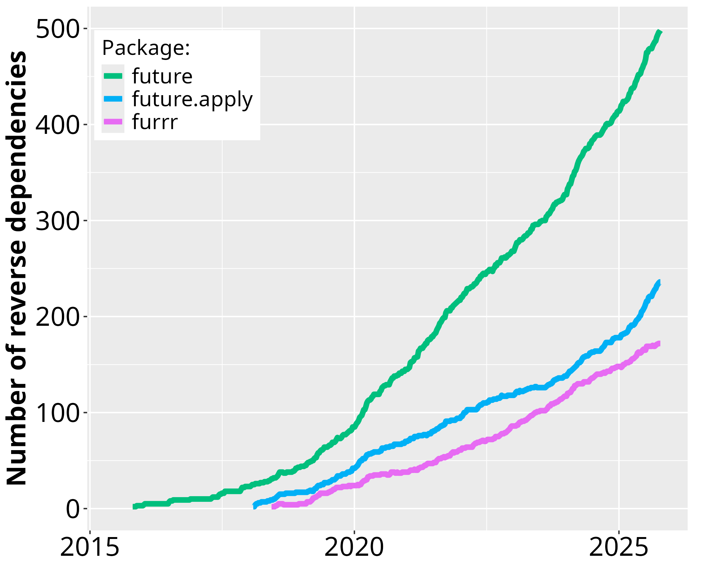

# Futureverse

* [**future**](https://future.futureverse.org)

* [**future.apply**](https://future.apply.futureverse.org)

* [**future.batchtools**](https://future.batchtools.futureverse.org)

* [**future.callr**](https://future.callr.futureverse.org)

* [**future.tests**](https://future.tests.futureverse.org)

* [**doFuture**](https://doFuture.futureverse.org)

* [**parallelly**](https://parallelly.futureverse.org)

* [**globals**](https://globals.futureverse.org)

* [**listenv**](https://listenv.futureverse.org)

* [**BiocParallel.FutureParam**](https://BiocParallel.FutureParam.futureverse.org)

* [**progressr**](https://progressr.futureverse.org)

# Uptake of future

 
Figure: Number of CRAN packages that depend on <strong>future</strong>, <strong>future.apply</strong>, and <strong>furrr</strong> over time since the first release in June 2015.  Because historical data for reverse dependencies on Bioconductor are hard to track down, they are currently not reported in this graph.

