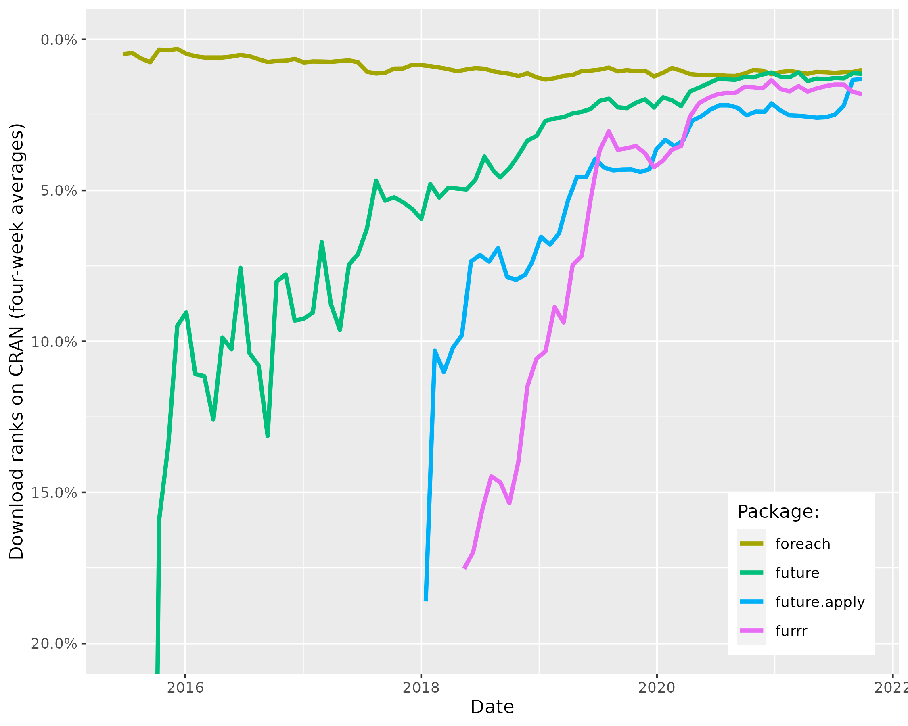
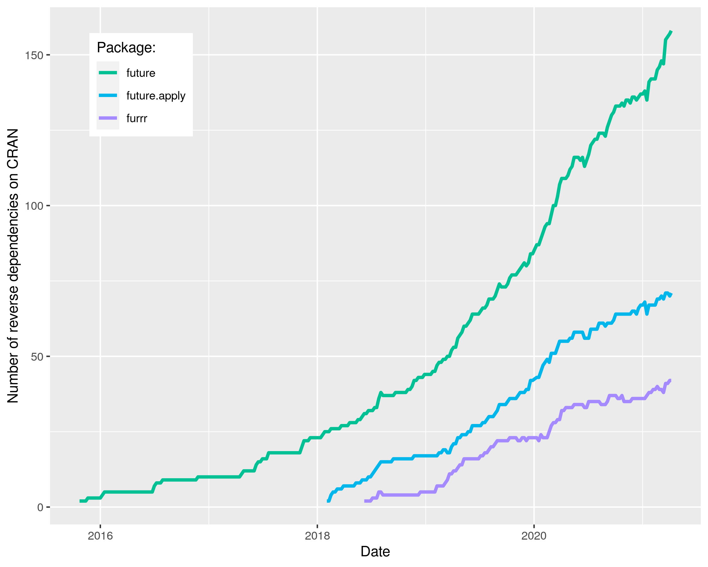
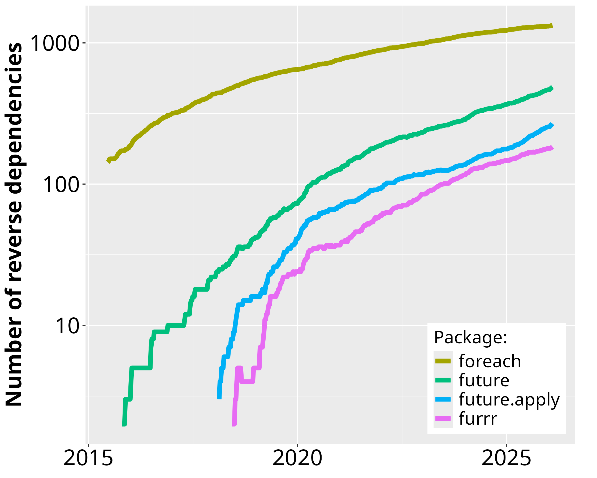

Since the first CRAN release of **future** in June 2015, its uptake
among end-users and package developers have grown steadily.  During
January 2023, **future** was among the top-0.9% most downloaded
package on CRAN (Figure 1) and there are 257 packages on CRAN that
directly depend on it (Figure 2).  For map-reduce parallelization
packages **future.apply** (top-1.3% most downloaded) and and **furrr**
(top 1.5%), the corresponding number of packages are 114 and 78,
respectively.  If we consider recursive dependencies too, that is,
packages that use the **future** package either directly or indirectly
via another package, then 85% of all ~19,000 CRAN packages may rely on
the future framework for their processing.

<!--
pkgs <- revdepcheck:::cran_revdeps("future")
pkgs <- tools::package_dependencies("future", which="all", reverse=TRUE, recursive=TRUE)
-->

<em>

Figure 1: The download percentile ranks for <strong>future</strong>,
<strong>future.apply</strong>, <strong>furrr</strong>, and
<strong>foreach</strong> averaged every four weeks.
<strong>future</strong> is among the top-0.9% most downloaded packages
on CRAN. The data are based on the RStudio CRAN mirror logs.  There
are approximately 150 million package downloads per month from the
RStudio CRAN mirror alone.  Since none of the other CRAN mirrors
provide statistics, it is impossible to know the total amount of
package installations.

<!-- [https://cranlogs.r-pkg.org/downloads/total/last-month] -->
</em>

As a reference, the popular **foreach**, released in 2009, was among
the top-1.0% most downloaded packages during the same period and it
has 817 reverse package dependencies on CRAN.  The number of users
that download **future** has grown rapidly whereas the the same number
has slowly decreased for the **foreach** package (Figure 1).
Similarly, the number of reverse package dependencies on **future**
appear to grow faster than for **foreach** (Figure 2).

 
<em>

Figure 2: Number of CRAN packages that depend on
<strong>future</strong>, <strong>future.apply</strong>,
<strong>furrr</strong>, and <strong>foreach</strong> over time since
the first release of <strong>future</strong> in June 2015.  Left: The
package counts on the linear scale without <strong>foreach</strong>.
Right: The same data on the logarithmic scale to fit also
<strong>foreach</strong>.  (Because historical data for reverse
dependencies on Bioconductor are hard to track down, they are
currently not reported in these graphs.)

</em>

Importantly, the comparison toward **foreach** is only done as a
reference for the current demand for parallelization frameworks in R
and to show the rapid uptake of the future framework since its
release.  It is not a competition because **foreach** can per design
be used in companion with the future framework via **doFuture**.  The
choice between **foreach** with **doFuture**, **future.apply**, and
**furrr** is a matter of preference of coding style - they all rely on
futures for parallelization.
