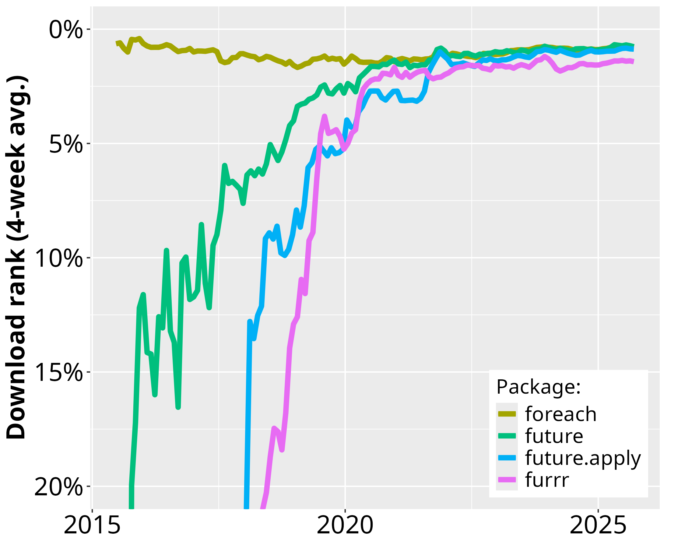

Since the first CRAN release of **future** in June 2015, its uptake among end-users and package developers have grown steadily.
During March 2021, **future** was among the top-1.0% most downloaded package on CRAN (Figure 1) and there are 170 packages on CRAN and Bioconductor that directly depend on it (Figure 2).  For map-reduce parallelization packages **future.apply** (top-2.1% most downloaded) and and **furrr** (top 1.4%), the corresponding number of packages are 75 and 44, respectively.

<em>Figure 1: The download percentile ranks for <strong>future</strong>, <strong>future.apply</strong>, <strong>furrr</strong>, and <strong>foreach</strong> average every four weeks.  <strong>future</strong> is among the top-1.0% most downloaded packages on CRAN. The data is based on the RStudio CRAN mirror logs.</em>

As a reference, the popular **foreach**, release in 2009, was among the top-0.9% most downloaded packages during the same period and it has almost 800 reverse package dependencies on CRAN and Bioconductor.  The number of users that download **future** has grown rapidly whereas the the same number has slowly decreased for the **foreach** package (Figure 1).  Similarly, the number of reverse package dependencies on **future** appear to grow faster than for **foreach** (Figure 2).

 
<em>Figure 2: Number of CRAN packages that depend on <strong>future</strong>, <strong>future.apply</strong>, <strong>furrr</strong>, and <strong>foreach</strong> over time since the first release of <strong>future</strong> in June 2015.  Left: The package counts on the linear scale without <strong>foreach</strong>.  Right: The same data on the logarithmic scale to fit also <strong>foreach</strong>.  (Because historical data for reverse dependencies on Bioconductor are hard to track down, they are currently not reported in this graph.)</em>

Importantly, the comparison toward **foreach** is only done as a reference for the current demand for parallelization frameworks in R and to show the rapid uptake of the future framework since its release.  It is not a competion because **foreach** can per design be used in companion with the future framework via **doFuture**.  The choice between **foreach** with **doFuture**, **future.apply**, and **furrr** is a matter of preference of coding style - they all rely on futures for parallelization.

