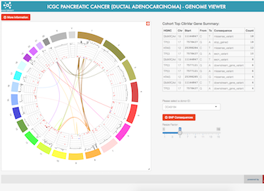
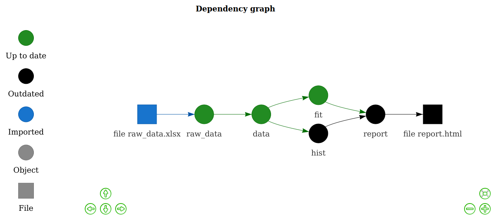

```{r setup, include=FALSE}
knitr::opts_chunk$set(echo = FALSE)
```
If we look at our main R packages repositories, [CRAN](https://cran.r-project.org/) (~18,000 packages) and [Bioconductor](https://bioconductor.org) (~2,000 packages), we find that the future framework is used by R packages spanning a wide range of areas, e.g. statistics, modeling & prediction, time-series analysis & forecasting, life sciences, drug analysis, clinical trials, disease modeling, cancer research, computational biology, genomics, bioinformatics, biomarker discovery, epidemiology, ecology, economics & finance, spatial, geospatial & satellite analysis, and natural language processing.  That is just a sample based on published R packages - we can only guess how futures are used by users at the R prompt, in users' R scripts, non-published R packages, Shiny applications, and R pipelines running internally in the industry and academia.

There are two major use cases of the future framework: (i) performance improvement through parallelization, and (ii) non-blocking, asynchronous user experience (UX).  Below are some prominent examples.


## EpiNow2: Estimate Real-Time Case Counts and Time-Varying Epidemiological Parameters

<div>
<figure style="width: 45%; float: right; text-align: right; margin: 0; margin-left: 2ex;">

<figcaption style="font-size: 50%;">Image credit: EpiNow2 team</figcaption>
</figure>
[**EpiNow2**](https://epiforecasts.io/EpiNow2/) is an R package to estimate real-time case counts and time-varying epidemiological parameters, such as [current trends of COVID-19 incidents](https://epiforecasts.io/covid/) in different regions around the globe.

**EpiNow2** uses futures to speed up processing.  The future framework is used to estimate incident rates in different regions concurrently as well as running Markov Chain Monte Carlo (MCMC) in parallel.
</div>


## Seurat: Large-Scale Single-Cell Genomics

<div>
<figure style="width: 45%; float: right; text-align: right; margin: 0; margin-left: 2ex;">

<figcaption style="font-size: 50%;">Image credit: Seurat team</figcaption>
</figure>
[**Seurat**](https://satijalab.org/seurat/) is an R package designed for QC, analysis, and exploration of single-cell RNA-seq data. Seurat aims to enable users to identify and interpret sources of heterogeneity from single-cell transcriptomic measurements, and to integrate diverse types of single-cell data.

**Seurat** uses futures to speed up processing.  The future framework makes it possible process large data sets and large number of samples in parallel on the local machine, distributed on multiple machines, or via large-scale high-performance compute (HPC) environments.
</div>


## Shiny: Scalable, Asynchronous UX

<div>
<figure style="width: 45%; float: right; text-align: right; margin: 0; margin-left: 2ex;">

<figcaption style="font-size: 50%;">Image credit: International Cancer Genome Consortium (ICGC) team</figcaption>
</figure>
[**Shiny**](https://shiny.rstudio.com/) is an R package that makes it easy to build interactive web applications and dashboards directly from R.  Shiny apps can run locally, be embedded in an R Markdown document, and be hosted on a webpage - all with a few clicks or commands.
The combination of being simple and powerful has made Shiny the most popular solution for web applications in the R community.  See the [Shiny Gallery](https://shiny.rstudio.com/gallery/) for real-world examples, e.g. the [Genome Browser](https://shiny.rstudio.com/gallery/genome-browser.html) by the International Cancer Genome Consortium (ICGC) team.

**Shiny** uses the future framework to provide a non-blocking user interface and to scale up computationally heavy requests.  It combines **future** with **promises** to turn a blocking, synchronous web interface into a non-blocking, asynchronous, responsive user experience.
</div>


## Mlr3: Next-Generation Machine Learning

<div>
<figure style="width: 45%; float: right; text-align: right; margin: 0; margin-left: 2ex;">

<figcaption style="font-size: 50%;">Image credit: ml3r team</figcaption>
</figure>
The [**mlr3**](https://mlr3.mlr-org.com/) ecosystem provides efficient, object-oriented building blocks for machine learning (ML) for tasks, learners, resamplings, and measures. It supports large-scale, out-of-memory data processing.    

**mlr3** uses futures to speed up processing.  The future framework is used in different ML steps, e.g. resampling of learners can be performed much faster when run in parallel.  The framework makes sure proper parallel random-number generation (RNG) is used and guarantees reproducible results.
</div>


## Drake/Targets: Pipeline Toolkit for Reproducible Computation at Scale

<div>
<figure style="width: 45%; float: right; text-align: right; margin: 0; margin-left: 2ex;">

<figcaption style="font-size: 50%;">Image credit: targets/drake team</figcaption>
</figure>
The [**targets**](https://docs.ropensci.org/targets/) package, and its predecessor [**drake**](https://docs.ropensci.org/drake/), is a general-purpose computational engine for statistics and data science that brings together function-oriented programming in R with make-like declarative workflows.  It has native support for parallel and distributed computing while preserving reproducibility.

Both **targets** and **drake** identify targets in the declared dependency graph that can be resolved concurrently, which then can be processed in parallel on the local computer or distributed in the cloud via the future framework.
</div>


